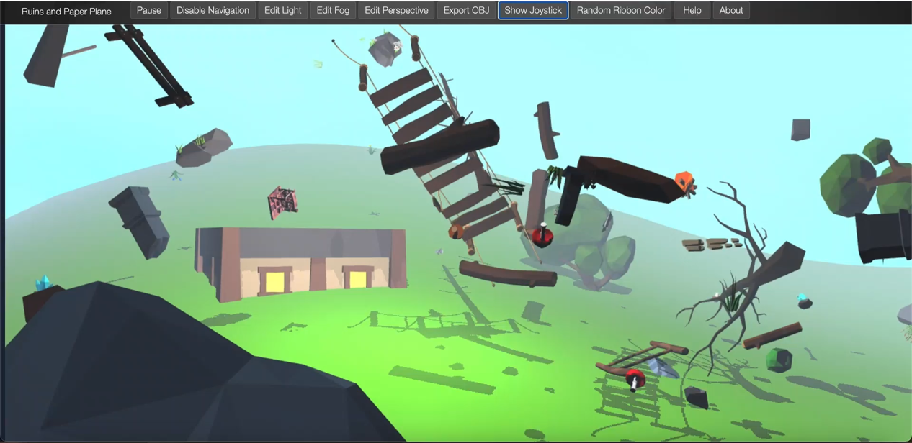

# Tron

Computer Graphics Project, inspired by the film *Tron*, based on WebGL. Click **[here](http://code.vtu.life/Tron/index.html)** to play!

### Directory structure
- Most of the codes are placed under `./src`.
- Some huge externel modules are placed under `./modules`.
- Models and pictures are stored under `./resource`. Do NOT take the 'NaturePack' OBJs for other usages!
- `pages` should never be used other than testing. However, there are some interesting testing works in it.

### Implemented with
- [twgl.js](https://github.com/greggman/twgl.js)
- [gl-matrix.js](https://github.com/toji/gl-matrix)
- [virtualjoystick.js](https://github.com/jeromeetienne/virtualjoystick.js)
- [webgl-lessons-ui.js](https://webglfundamentals.org/webgl/lessons/zh_cn/)
- [navStyle.css](https://webgl-shaders.com/)
- [perlin.js](https://github.com/wwwtyro/perlin.js)
- [LowPoly Nature - Trees Grass and Rocks Low-poly 3D model](https://www.cgtrader.com/3d-models/exterior/landscape/lowpoly-nature-trees-grass-and-rocks) Nature Pack models bought from *cgtrader*
- [Paper airplane Low-poly 3D model](https://www.cgtrader.com/3d-models/sports/toy/paper-airplane-a16df32d-2b2f-4016-89a8-67d9598234b7) Paper Plane model bought from *cgtrader*

### Referencing
- [WebGL with Perlin Noise  Part - 1](https://medium.com/neosavvy-labs/webgl-with-perlin-noise-part-1-a87b56bbc9fb)
- [WebGL Fundamentals](https://webglfundamentals.org/webgl/lessons/zh_cn/)

### Document in Chinese
- [《Tron: CG Project 系统设计说明文档》](https://www.yuque.com/docs/share/559b3525-16fe-4686-b8ae-18cc94a64cfa?#)

### **Notice**:
- Since we're using ES6 features, you need to forward the code to a port if you are trying to run it locally on your PC.